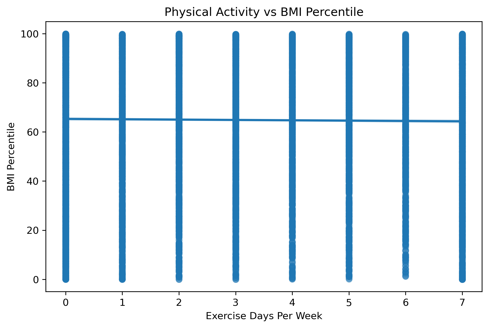
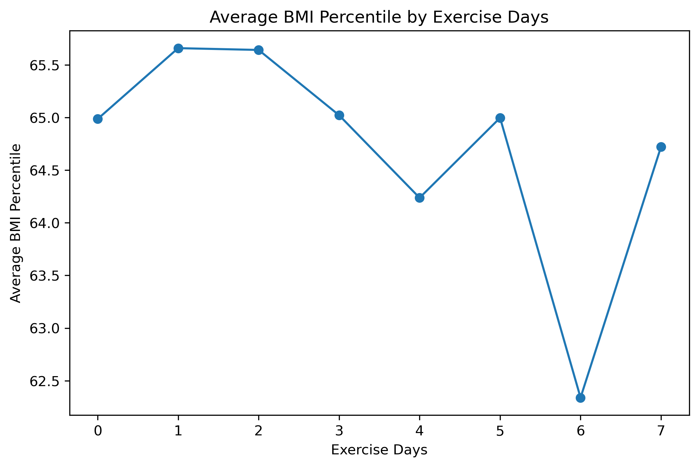
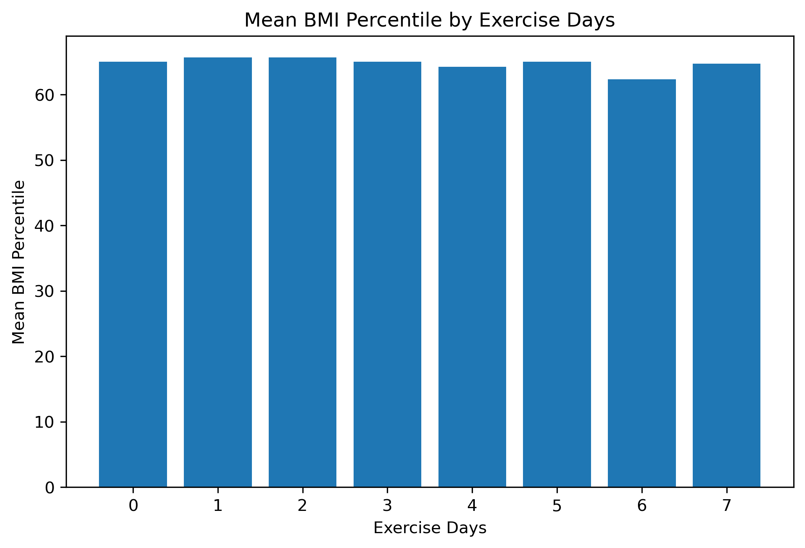

# Final-Individual-Project

# Physical Activity and BMI Percentile

## Research Question

Is there a significant relationship between physical activity and BMI percentile among students?

## Dataset

YRBS 2007

## Variables

- ExerciseDays
- BMIPercentile

## Method

Simple Linear Regression

## Main Results

- Sample Size: 12,527
- Regression Coefficient: -0.1393
- p-value: 0.145
- R-squared: 0.000

## Conclusion

No significant relationship was found between physical activity and BMI percentile.

## Figures

### Scatter Plot

### Average BMI Percentile

### Mean BMI Percentile

