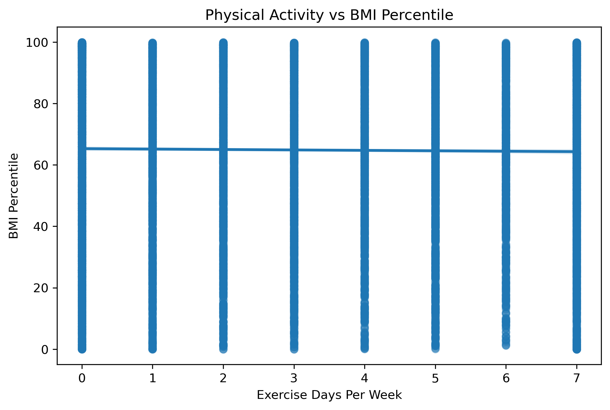

# Final-Individual-Project
工管二乙 113370203 吳佳虹
# Physical Activity and BMI Percentile

## Research Question

Does physical activity affect BMI percentile among high school students?

---

## Dataset

This project uses data from the Youth Risk Behavior Survey (YRBS) 2007.

---

## Variables

### Independent Variable
- ExerciseDays
- Number of days with physical activity in the past week (0–7 days)

### Dependent Variable
- BMIPCT
- BMI Percentile

---

## Data Cleaning

The following steps were performed:

1. Removed missing values.
2. Kept BMI percentile values between 1 and 99.
3. Recoded ExerciseDays from the original coding to 0–7 days.
4. Created a cleaned dataset for analysis.

---

## Statistical Methods

The following methods were used:

- Descriptive Statistics
- Correlation Analysis
- Linear Regression

---

## Results

### Descriptive Statistics

- Sample Size: 12,527
- Mean Exercise Days: 3.09
- Mean BMI Percentile: 64.86
- Standard Deviation of BMI Percentile: 27.46

### Correlation Analysis

- Correlation (r): -0.013
- p-value: 0.145

### Linear Regression

- Intercept: 65.29
- Slope: -0.14
- R²: 0.00
- p-value: 0.145

---

## Interpretation

The correlation between physical activity and BMI percentile was very weak and negative. The p-value was greater than 0.05, indicating that the relationship was not statistically significant.

---

## Conclusion

Based on the analysis, physical activity days did not show a significant relationship with BMI percentile among students in the YRBS 2007 dataset.

---

## Repository Contents

- Code
- Cleaned Data
- Figures
- Tables
- One-page Infographic
- Presentation Video

### Scatter Plot

